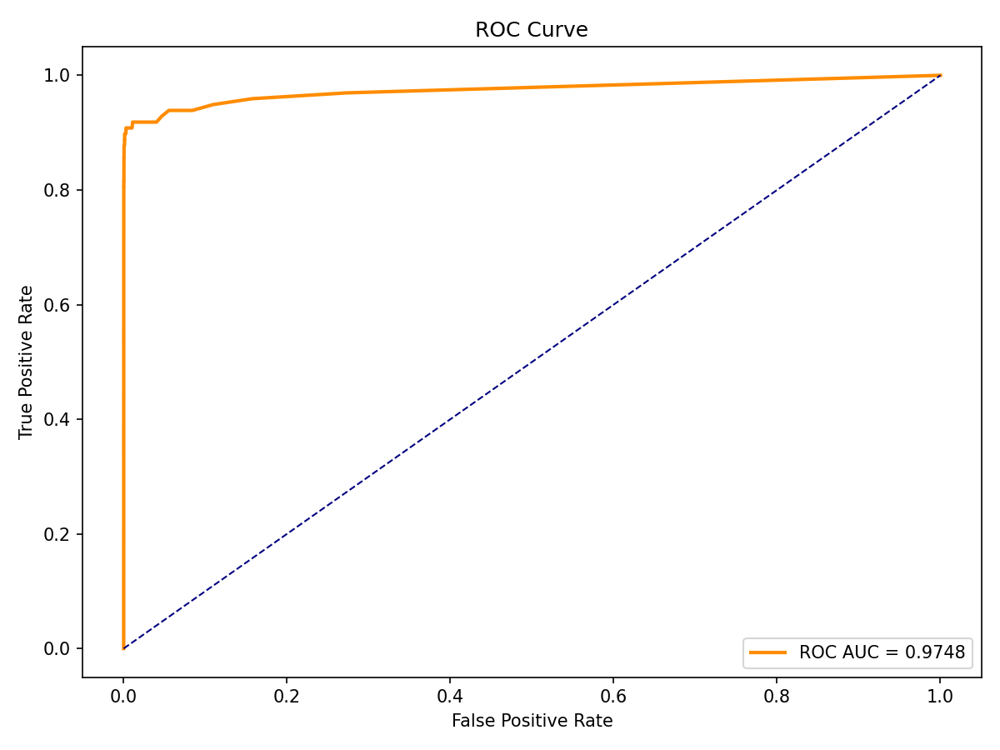
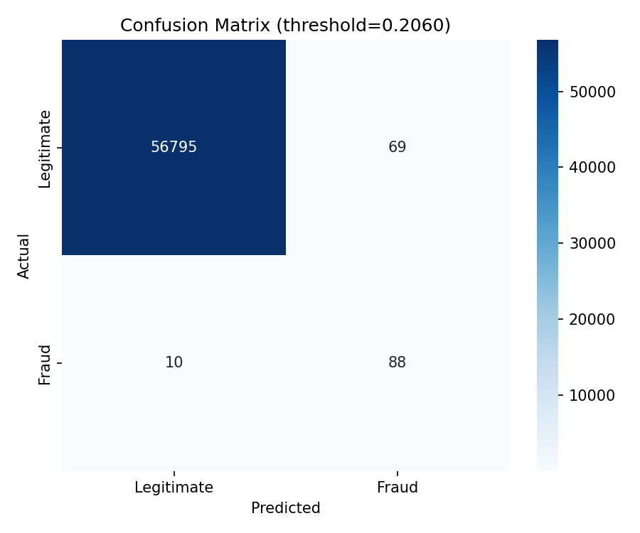
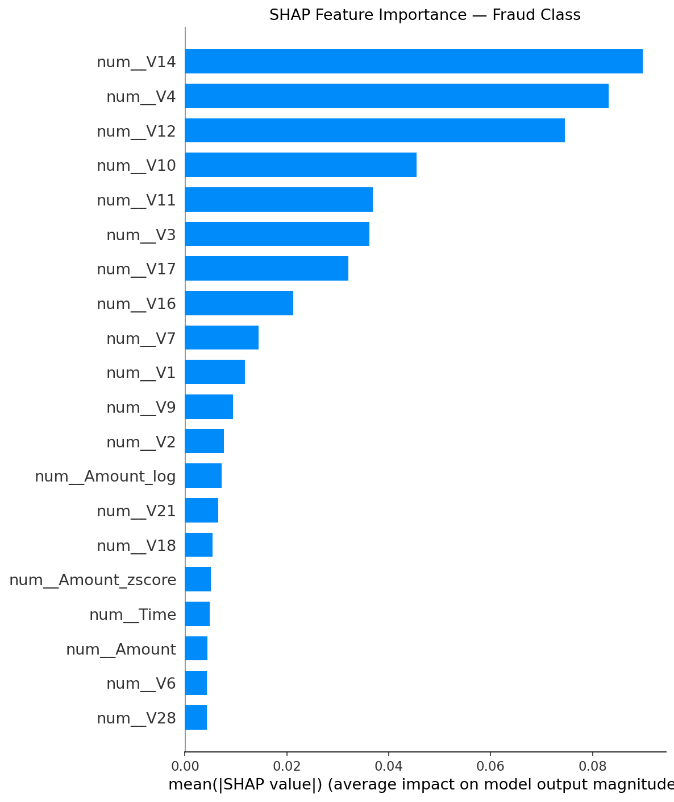
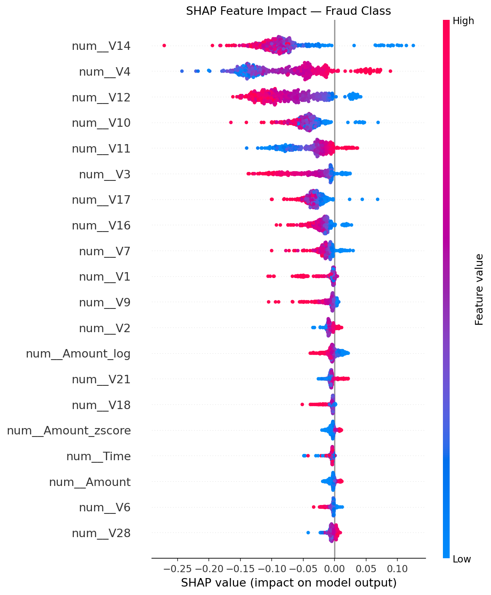

# 🛡️ AutoML-X — Intelligent Fraud Detection System


[](https://github.com/Sujal-baghela/Automl-fraud-detection/actions/workflows/ci.yml)


---

## 📌 Overview

**AutoML-X** is a production-ready, end-to-end machine learning system for credit card fraud detection. It automatically trains, evaluates, and selects the best model from 5 competing algorithms using cross-validation, applies feature engineering on raw transaction data, optimizes the decision threshold based on real business costs, and serves predictions through a FastAPI REST API with full SHAP explainability.

Built as a **Minor Project** at **Madhav Institute of Technology and Science**.

---

## 🎯 Key Results

| Metric | Value |
|--------|-------|
| 🏆 Best Model | Random Forest |
| 📈 CV ROC-AUC | **0.99999** |
| 📊 Test ROC-AUC | **0.97482** |
| 🎯 Frauds Caught | **88 / 98 (89.8% Recall)** |
| 💰 Minimum Business Cost | **$113,800** |
| ⚡ Optimal Threshold | **0.20603** (cost-optimized) |
| 🔢 Total Features | **35** (30 original + 5 engineered) |
| 🔁 Imbalance Handling | SMOTE (50/50 balanced) |
| 🧪 Test Suite | **285 tests passing** |
| 📋 CI/CD | GitHub Actions — lint + test on every push |
| 📊 Coverage | **99%** |

---

## 🌐 Live Demo

| Service | URL |
|---|---|
| FastAPI REST API | `https://dark-ui-automl-x-fraud-detection.hf.space` |
| Streamlit Dashboard | `https://dark-ui-automl-x-fraud-detection-8501.hf.space` |
| MLflow UI | `https://dark-ui-automl-x-fraud-detection-5000.hf.space` |

---

## 📊 Evaluation Reports

**ROC Curve (AUC = 0.97482)**



**Confusion Matrix (Threshold = 0.20603)**



---

## 🔍 SHAP Explainability

**Feature Importance — Mean |SHAP| (Top 20 Features)**



**Feature Impact Direction — Beeswarm Plot**



> Top fraud indicators: `V14`, `V4`, `V12`, `V10`, `V3` — consistent with published research on this dataset.

---

## 🏗️ System Architecture

```
creditcard.csv
      │
      ▼
 DataLoader ──► imbalance detection (0.17% fraud rate)
      │
      ▼
 DataCleaner ──► remove duplicates, impute missing, log outliers
      │
      ▼
 Feature Engineering (+5 derived features)
      ├── Hour          (fraud varies by time of day)
      ├── Night_txn     (10pm–6am binary flag)
      ├── Amount_log    (log transform — compresses skew)
      ├── Amount_zscore (how unusual is this amount)
      └── High_amount   (Amount > $1,000 binary flag)
      │
      ▼
 SMOTE Oversampling ──► balanced training set (50/50)
      │
      ▼
 AutoModelSelector — 5 models compete via cross-validation
      ├── LogisticRegression    (ROC-AUC: 0.99812)
      ├── RandomForest          (ROC-AUC: 0.99999) ✅ selected
      ├── LightGBM_Balanced     (ROC-AUC: 0.99998)
      ├── LightGBM_HighRecall   (ROC-AUC: 0.99997)
      └── XGBoost_HighRecall    (ROC-AUC: 0.99993)
      │
      ▼
 BusinessCostOptimizer ──► threshold = 0.20603
      │                    cost = $113,800
      ▼
 best_model.pkl ──► FastAPI ──► /predict
      │                   └──► /predict/batch
      │                   └──► SHAP explanation per transaction
      ▼
 DriftDetector ──► PSI + KS test on new data
      │
      ▼
 ModelMonitor ──► SQLite logging + alert rules
      │
      ▼
 AlertManager ──► Slack webhook + log file
      │
      ▼
 MLflow ──► experiment tracking + model registry
```

---

## 🔧 New: Monitoring & Alerting

| Endpoint | Method | Description |
|---|---|---|
| `/monitor/health` | GET | System health + DB status |
| `/monitor/summary` | GET | Rolling prediction statistics |
| `/monitor/alerts` | GET | Alert history |
| `/monitor/check-alerts` | POST | Trigger alert rule evaluation |

Alert rules:
- 🔴 **CRITICAL** — Fraud rate exceeds 30% in last 100 predictions
- 🟡 **WARNING** — Average model confidence drops below 60%
- 🟡 **WARNING** — Data drift detected (PSI ≥ 0.1 on 10%+ of features)

---

## 🧪 Experimentation Journey

| Run | Technique | Model | Recall | Cost | Outcome |
|-----|-----------|-------|--------|------|---------|
| 1 | SMOTE | RandomForest (30 features) | 90.8% | $108,400 | Strong baseline |
| 2 | BorderlineSMOTE | LightGBM | 84.7% | $151,800 | Lower recall |
| 3 | SMOTETomek | LightGBM variants | 84.7% | $157,200 | No improvement |
| 4 | SMOTE + Feature Eng. | LightGBM_Balanced | 88.8% | $118,800 | Best Test AUC |
| **5** | **SMOTE + Feature Eng.** | **RandomForest (35 features)** | **89.8%** | **$113,800** | **✅ Final** |

---

## 💰 Business Cost Optimization

```
Total Cost = (Missed Frauds × $10,000) + (False Alarms × $200)

Final result at threshold 0.20603:
  10 frauds missed  ×  $10,000  =  $100,000
  69 false alarms   ×    $200   =   $13,800
  ─────────────────────────────────────────
  Total minimum cost            =  $113,800
```

---

## 🚀 Quick Start

```bash
# 1. Clone
git clone https://github.com/Sujal-baghela/Automl-fraud-detection.git
cd Automl-fraud-detection

# 2. Install
pip install -r requirements.txt

# 3. Add dataset
# Download creditcard.csv from Kaggle → place at Data/creditcard.csv

# 4. Train
python -m Scripts.train

# 5. Run API
uvicorn app.api:app --reload --port 8000

# 6. Run Dashboard
streamlit run app/dashboard.py

# 7. Run MLflow
mlflow ui --port 5000

# 8. Docker (all services)
docker-compose up --build
```

---

## 🌐 API Endpoints

| Method | Endpoint | Description |
|--------|----------|-------------|
| `GET` | `/` | Health check |
| `GET` | `/model-info` | Model metadata |
| `POST` | `/predict` | Single prediction + SHAP |
| `POST` | `/predict/batch` | Batch prediction |
| `GET` | `/monitor/health` | System health |
| `GET` | `/monitor/summary` | Rolling stats |
| `GET` | `/monitor/alerts` | Alert history |

---

## 📂 Project Structure

```
automl-x/
├── .github/workflows/ci.yml
├── app/
│   ├── api.py                  # FastAPI + monitoring integration
│   ├── dashboard.py            # Streamlit dashboard
│   └── universal.py
├── src/
│   ├── monitor.py              # ModelMonitor — SQLite logging
│   ├── alerting.py             # AlertManager — Slack + log file
│   ├── drift_detector.py
│   ├── fraud_system.py
│   ├── inference_engine.py
│   ├── model_selector.py
│   └── ...
├── tests/
│   ├── test_monitor.py         # 96 tests
│   ├── test_pipeline.py
│   └── ...
├── models/
│   ├── best_model.pkl
│   └── drift_reference.json
├── Dockerfile
├── supervisord.conf
├── docker-compose.yml
└── requirements.txt
```

---

## 📦 Tech Stack

| Category | Library |
|----------|---------|
| ML Models | scikit-learn, LightGBM, XGBoost |
| Imbalance | imbalanced-learn (SMOTE) |
| Explainability | SHAP 0.50.0 |
| API | FastAPI, Uvicorn |
| Dashboard | Streamlit |
| Monitoring | SQLite, custom ModelMonitor |
| Alerting | Slack webhook, log file |
| Experiment Tracking | MLflow |
| Data | Pandas, NumPy, SciPy |
| Visualization | Matplotlib, Seaborn |
| Testing | pytest, pytest-cov (99% coverage) |
| Linting | Ruff |
| CI/CD | GitHub Actions |

---

## 👥 Authors

**Sujal Baghela** — [@Sujal-baghela](https://github.com/Sujal-baghela)

**Sameer Bhilware** — [@SameerBhilware-ui](https://github.com/SameerBhilware-ui)

**Institution:** Madhav Institute of Technology and Science

---

## 📄 License

MIT License